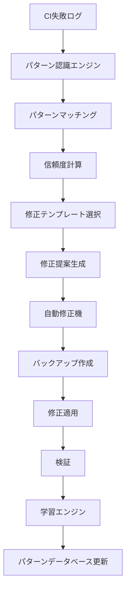

# 設計書

## 概要

本設計書は、CI-HelperのAI分析機能を強化し、パターン認識エンジンと自動修正提案システムを実装するための技術設計を定義します。既存のAI統合アーキテクチャを拡張し、よくあるCI失敗パターンの自動検出、具体的な修正提案の生成、および自動修正機能を提供します。

## アーキテクチャ

### システム全体構成

```
src/ci_helper/ai/
├── integration.py              # 既存: メイン統合ロジック
├── models.py                   # 既存: データモデル（拡張）
├── fix_generator.py            # 既存: 修正提案生成（拡張）
├── pattern_engine.py           # 新規: パターン認識エンジン
├── fix_templates.py            # 新規: 修正テンプレート管理
├── auto_fixer.py              # 新規: 自動修正機能
├── learning_engine.py          # 新規: 学習機能
├── pattern_matcher.py          # 新規: パターンマッチング
└── confidence_calculator.py    # 新規: 信頼度計算

data/
├── patterns/                   # パターンデータベース
│   ├── ci_patterns.json       # CI失敗パターン
│   ├── build_patterns.json    # ビルドエラーパターン
│   ├── test_patterns.json     # テストエラーパターン
│   └── custom_patterns.json   # ユーザー定義パターン
├── templates/                  # 修正テンプレート
│   ├── permission_fixes.json  # 権限エラー修正
│   ├── dependency_fixes.json  # 依存関係修正
│   └── config_fixes.json      # 設定修正
└── learning/                   # 学習データ
    ├── feedback.json          # ユーザーフィードバック
    └── patterns_learned.json  # 学習済みパターン
```

### データフロー



## コンポーネント設計

### 1. パターン認識エンジン (pattern_engine.py)

**責任**: CI失敗ログからエラーパターンを特定し、分類する

**主要クラス**:

```python
class PatternRecognitionEngine:
    """パターン認識エンジンのメインクラス"""

    def __init__(self, pattern_database: PatternDatabase)
    async def analyze_log(self, log_content: str) -> List[PatternMatch]
    async def identify_patterns(self, log_content: str) -> List[Pattern]
    def calculate_confidence(self, pattern: Pattern, match_data: dict) -> float
```

**主要機能**:

- 正規表現ベースのパターンマッチング
- キーワード検出による分類
- 複数パターンの優先度付けランキング
- 信頼度スコア計算

### 2. パターンマッチング (pattern_matcher.py)

**責任**: 具体的なパターンマッチング処理を実行

**主要クラス**:

```python
class PatternMatcher:
    """パターンマッチング処理クラス"""

    def match_regex_patterns(self, text: str, patterns: List[Pattern]) -> List[Match]
    def match_keyword_patterns(self, text: str, keywords: List[str]) -> List[Match]
    def extract_error_context(self, text: str, match_position: int) -> str
    def calculate_match_strength(self, match: Match, pattern: Pattern) -> float
```

### 3. 信頼度計算機 (confidence_calculator.py)

**責任**: パターンマッチと修正提案の信頼度を計算

**主要クラス**:

```python
class ConfidenceCalculator:
    """信頼度計算クラス"""

    def calculate_pattern_confidence(self, pattern_match: PatternMatch) -> float
    def calculate_fix_confidence(self, fix_suggestion: FixSuggestion, pattern_match: PatternMatch) -> float
    def adjust_confidence_by_context(self, base_confidence: float, context: dict) -> float
```

**計算要素**:

- パターンマッチの強度 (0.0-1.0)
- 過去の成功率データ
- エラーコンテキストの明確さ
- 複数パターンの一致度

### 4. 修正テンプレート管理 (fix_templates.py)

**責任**: パターンに対応する修正テンプレートを管理

**主要クラス**:

```python
class FixTemplateManager:
    """修正テンプレート管理クラス"""

    def __init__(self, template_directory: Path)
    def get_template_for_pattern(self, pattern: Pattern) -> FixTemplate
    def customize_template(self, template: FixTemplate, context: dict) -> FixSuggestion
    def validate_template(self, template: FixTemplate) -> bool
```

**テンプレート構造**:

```json
{
  "id": "permission_docker_fix",
  "name": "Docker権限エラー修正",
  "pattern_ids": ["docker_permission_denied"],
  "fix_steps": [
    {
      "type": "file_modification",
      "file_path": ".actrc",
      "action": "append",
      "content": "--privileged"
    }
  ],
  "risk_level": "low",
  "estimated_time": "2分",
  "success_rate": 0.95
}
```

### 5. 自動修正機 (auto_fixer.py)

**責任**: 承認された修正を自動的に適用し、バックアップとロールバック機能を提供

**主要クラス**:

```python
class AutoFixer:
    """自動修正機能クラス"""

    def __init__(self, backup_manager: BackupManager)
    async def apply_fix(self, fix_suggestion: FixSuggestion, auto_approve: bool = False) -> FixResult
    def create_backup(self, files: List[str]) -> BackupInfo
    def rollback_changes(self, backup_info: BackupInfo) -> bool
    def verify_fix_application(self, fix_suggestion: FixSuggestion) -> bool
```

**安全機能**:

- 修正前の自動バックアップ
- 修正後の検証チェック
- 失敗時の自動ロールバック
- リスクレベル別の承認フロー

### 6. 学習エンジン (learning_engine.py)

**責任**: 新しいパターンの学習とユーザーフィードバックの処理

**主要クラス**:

```python
class LearningEngine:
    """学習エンジンクラス"""

    def __init__(self, pattern_database: PatternDatabase)
    async def learn_from_feedback(self, feedback: UserFeedback) -> None
    async def discover_new_patterns(self, failed_logs: List[str]) -> List[Pattern]
    def update_pattern_confidence(self, pattern_id: str, success: bool) -> None
    def suggest_pattern_improvements(self) -> List[PatternImprovement]
```

## データモデル拡張

### 既存モデルの拡張

```python
# models.py に追加

@dataclass
class Pattern:
    """エラーパターン定義"""
    id: str                          # パターンID
    name: str                        # パターン名
    category: str                    # カテゴリ（permission/network/config等）
    regex_patterns: List[str]        # 正規表現パターン
    keywords: List[str]              # キーワードリスト
    context_requirements: List[str]  # コンテキスト要件
    confidence_base: float           # 基本信頼度
    success_rate: float              # 過去の成功率
    created_at: datetime             # 作成日時
    updated_at: datetime             # 更新日時
    user_defined: bool = False       # ユーザー定義フラグ

@dataclass
class PatternMatch:
    """パターンマッチ結果"""
    pattern: Pattern                 # マッチしたパターン
    confidence: float                # 信頼度スコア
    match_positions: List[int]       # マッチ位置
    extracted_context: str           # 抽出されたコンテキスト
    match_strength: float            # マッチ強度
    supporting_evidence: List[str]   # 裏付け証拠

@dataclass
class FixTemplate:
    """修正テンプレート"""
    id: str                          # テンプレートID
    name: str                        # テンプレート名
    description: str                 # 説明
    pattern_ids: List[str]           # 対応パターンID
    fix_steps: List[FixStep]         # 修正ステップ
    risk_level: str                  # リスクレベル
    estimated_time: str              # 推定時間
    success_rate: float              # 成功率
    prerequisites: List[str]         # 前提条件
    validation_steps: List[str]      # 検証ステップ

@dataclass
class FixStep:
    """修正ステップ"""
    type: str                        # ステップタイプ（file_modification/command/config_change）
    description: str                 # ステップ説明
    file_path: str | None = None     # 対象ファイルパス
    action: str | None = None        # アクション（append/replace/create）
    content: str | None = None       # 変更内容
    command: str | None = None       # 実行コマンド
    validation: str | None = None    # 検証方法

@dataclass
class FixResult:
    """修正結果"""
    success: bool                    # 成功フラグ
    applied_steps: List[FixStep]     # 適用されたステップ
    backup_info: BackupInfo | None  # バックアップ情報
    error_message: str | None = None # エラーメッセージ
    verification_passed: bool = False # 検証結果
    rollback_available: bool = False  # ロールバック可能フラグ

@dataclass
class BackupInfo:
    """バックアップ情報"""
    backup_id: str                   # バックアップID
    created_at: datetime             # 作成日時
    files: List[BackupFile]          # バックアップファイル
    description: str                 # 説明

@dataclass
class BackupFile:
    """バックアップファイル"""
    original_path: str               # 元のファイルパス
    backup_path: str                 # バックアップファイルパス
    checksum: str                    # チェックサム

@dataclass
class UserFeedback:
    """ユーザーフィードバック"""
    pattern_id: str                  # パターンID
    fix_suggestion_id: str           # 修正提案ID
    rating: int                      # 評価（1-5）
    success: bool                    # 修正成功フラグ
    comments: str | None = None      # コメント
    timestamp: datetime = field(default_factory=datetime.now)
```

### 設定拡張

```python
# 既存のAIConfigクラスに追加
@dataclass
class AIConfig:
    # ... 既存フィールド ...

    # パターン認識設定
    pattern_recognition_enabled: bool = True
    pattern_confidence_threshold: float = 0.7
    pattern_database_path: str = "data/patterns"
    custom_patterns_enabled: bool = True

    # 自動修正設定
    auto_fix_enabled: bool = False
    auto_fix_confidence_threshold: float = 0.8
    auto_fix_risk_tolerance: str = "low"  # low/medium/high
    backup_retention_days: int = 30

    # 学習設定
    learning_enabled: bool = True
    feedback_collection_enabled: bool = True
    pattern_discovery_enabled: bool = True
    min_pattern_occurrences: int = 3
```

## インターフェース設計

### 1. パターン認識API

```python
class PatternRecognitionEngine:
    async def analyze_log(self, log_content: str, options: PatternAnalysisOptions) -> PatternAnalysisResult:
        """ログを分析してパターンを特定"""

    async def get_pattern_suggestions(self, log_content: str) -> List[PatternSuggestion]:
        """パターン提案を取得"""

    def get_supported_patterns(self) -> List[Pattern]:
        """サポートされているパターン一覧を取得"""
```

### 2. 修正提案API

```python
class EnhancedFixGenerator(FixSuggestionGenerator):
    async def generate_pattern_based_fixes(self, pattern_matches: List[PatternMatch], log_content: str) -> List[FixSuggestion]:
        """パターンベースの修正提案を生成"""

    async def customize_fix_for_context(self, template: FixTemplate, context: dict) -> FixSuggestion:
        """コンテキストに応じて修正をカスタマイズ"""
```

### 3. 自動修正API

```python
class AutoFixer:
    async def apply_fix_with_approval(self, fix_suggestion: FixSuggestion, approval_callback: Callable) -> FixResult:
        """承認付きで修正を適用"""

    async def batch_apply_fixes(self, fixes: List[FixSuggestion], auto_approve_low_risk: bool = True) -> BatchFixResult:
        """複数の修正を一括適用"""

    def get_rollback_options(self, timeframe: timedelta) -> List[BackupInfo]:
        """ロールバック可能なバックアップを取得"""
```

## エラーハンドリング

### 新しい例外クラス

```python
class PatternRecognitionError(AIError):
    """パターン認識エラー"""
    pass

class FixApplicationError(AIError):
    """修正適用エラー"""
    def __init__(self, message: str, rollback_info: BackupInfo | None = None):
        super().__init__(message)
        self.rollback_info = rollback_info

class TemplateValidationError(AIError):
    """テンプレート検証エラー"""
    pass

class LearningEngineError(AIError):
    """学習エンジンエラー"""
    pass
```

### エラー回復戦略

1. **パターン認識失敗**: フォールバック分析を実行
2. **修正適用失敗**: 自動ロールバックを実行
3. **テンプレート不正**: デフォルトテンプレートを使用
4. **学習エラー**: 学習を無効化して継続

## テスト戦略

### 1. ユニットテスト

- パターンマッチング精度テスト
- 信頼度計算アルゴリズムテスト
- 修正テンプレート検証テスト
- バックアップ・ロールバック機能テスト

### 2. 統合テスト

- エンドツーエンドの分析・修正フローテスト
- 複数パターンの競合解決テスト
- 学習機能の動作テスト

### 3. パフォーマンステスト

- 大量ログの処理性能テスト
- パターンデータベースの検索性能テスト
- 並行処理時の安定性テスト

## セキュリティ考慮事項

### 1. 自動修正の安全性

- 修正前の必須バックアップ
- リスクレベル別の承認フロー
- 重要ファイルの変更制限
- 修正内容の事前検証

### 2. パターンデータの保護

- ユーザー定義パターンの暗号化
- 機密情報のフィルタリング
- 学習データの匿名化

### 3. 権限管理

- ファイル変更権限の最小化
- 自動修正の権限制御
- バックアップファイルのアクセス制御

## パフォーマンス最適化

### 1. パターンマッチング最適化

- 正規表現の事前コンパイル
- パターンの優先度付け検索
- 並列パターンマッチング

### 2. キャッシュ戦略

- パターンマッチ結果のキャッシュ
- 修正テンプレートのメモリキャッシュ
- 学習データの効率的な更新

### 3. メモリ管理

- 大量ログの分割処理
- 不要なパターンデータの解放
- バックアップファイルの定期クリーンアップ

## 運用・監視

### 1. メトリクス収集

- パターン認識精度の追跡
- 修正成功率の監視
- 学習効果の測定

### 2. ログ記録

- パターンマッチの詳細ログ
- 修正適用の監査ログ
- エラーとフォールバックの記録

### 3. アラート設定

- 修正失敗率の異常検知
- パターン認識精度の低下検知
- システムリソースの監視

この設計により、CI-Helperは単なる診断ツールから、インテリジェントな自動修復ツールへと進化し、開発者の生産性を大幅に向上させることができます。
