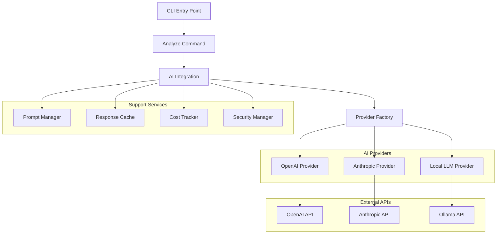
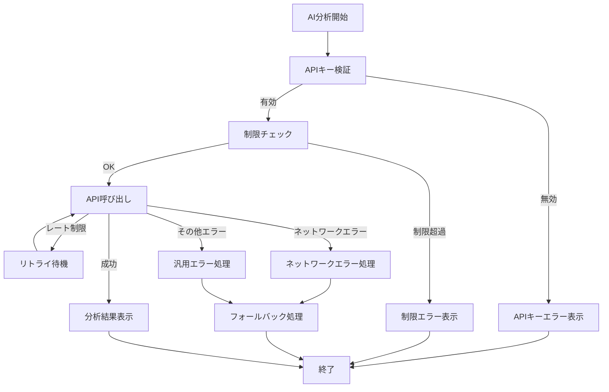

# AI統合機能 設計文書

## 概要

ci-helper AI統合機能は、既存のci-helperツールにAI分析機能を追加するモジュラー設計です。プラグイン的なアーキテクチャを採用し、複数のAIプロバイダーに対応しながら、セキュリティとパフォーマンスを重視した実装を行います。

## アーキテクチャ

### 全体構成

```
ci-helper/
├── src/ci_helper/
│   ├── ai/                     # AI統合モジュール（新規追加）
│   │   ├── __init__.py
│   │   ├── integration.py      # AI統合のメインロジック
│   │   ├── providers/          # AIプロバイダー実装
│   │   │   ├── __init__.py
│   │   │   ├── base.py         # 基底プロバイダークラス
│   │   │   ├── openai.py       # OpenAI実装
│   │   │   ├── anthropic.py    # Anthropic実装
│   │   │   └── local.py        # ローカルLLM実装
│   │   ├── prompts.py          # プロンプトテンプレート管理
│   │   ├── cache.py            # AIレスポンスキャッシュ
│   │   ├── cost_tracker.py     # コスト管理
│   │   └── security.py         # セキュリティ機能
│   ├── commands/
│   │   └── analyze.py          # 新しいanalyzeコマンド
│   └── utils/
│       └── ai_config.py        # AI設定管理
```

### アーキテクチャ図



## コンポーネントと インターフェース

### 1. Analyzeコマンド (`commands/analyze.py`)

```python
@click.command()
@click.option('--log', type=click.Path(exists=True), help='分析するログファイル')
@click.option('--provider', type=click.Choice(['openai', 'anthropic', 'local']), help='AIプロバイダー')
@click.option('--model', help='使用するモデル名')
@click.option('--prompt', help='カスタムプロンプト')
@click.option('--fix', is_flag=True, help='修正提案を生成')
@click.option('--interactive', is_flag=True, help='対話モード')
@click.option('--no-cache', is_flag=True, help='キャッシュを無視')
@click.option('--stats', is_flag=True, help='使用統計を表示')
@click.pass_context
def analyze(ctx, **kwargs):
    """CI失敗ログをAI分析"""
```

### 2. AI統合メインロジック (`ai/integration.py`)

```python
class AIIntegration:
    def __init__(self, config: AIConfig):
        self.config = config
        self.provider_factory = ProviderFactory()
        self.prompt_manager = PromptManager()
        self.cache = ResponseCache()
        self.cost_tracker = CostTracker()
        self.security = SecurityManager()

    async def analyze_log(self, log_content: str, options: AnalyzeOptions) -> AnalysisResult:
        """ログを分析してAI結果を返す"""

    async def interactive_session(self, initial_log: str) -> None:
        """対話的なAIセッションを開始"""

    def get_usage_stats(self) -> UsageStats:
        """使用統計を取得"""
```

### 3. プロバイダー基底クラス (`ai/providers/base.py`)

```python
from abc import ABC, abstractmethod
from typing import AsyncIterator, Optional

class AIProvider(ABC):
    def __init__(self, config: ProviderConfig):
        self.config = config

    @abstractmethod
    async def analyze(self, prompt: str, context: str) -> AnalysisResult:
        """分析を実行"""

    @abstractmethod
    async def stream_analyze(self, prompt: str, context: str) -> AsyncIterator[str]:
        """ストリーミング分析を実行"""

    @abstractmethod
    def estimate_cost(self, input_tokens: int, output_tokens: int) -> float:
        """コストを推定"""

    @abstractmethod
    def get_available_models(self) -> List[str]:
        """利用可能なモデル一覧を取得"""
```

### 4. OpenAIプロバイダー (`ai/providers/openai.py`)

```python
import openai
from .base import AIProvider

class OpenAIProvider(AIProvider):
    def __init__(self, config: ProviderConfig):
        super().__init__(config)
        self.client = openai.AsyncOpenAI(api_key=config.api_key)

    async def analyze(self, prompt: str, context: str) -> AnalysisResult:
        """OpenAI APIを使用して分析"""

    async def stream_analyze(self, prompt: str, context: str) -> AsyncIterator[str]:
        """ストリーミング分析"""

    def estimate_cost(self, input_tokens: int, output_tokens: int) -> float:
        """OpenAIの料金体系に基づくコスト計算"""
```

### 5. プロンプトテンプレート管理 (`ai/prompts.py`)

```python
class PromptManager:
    def __init__(self, config_path: Optional[str] = None):
        self.templates = self._load_templates(config_path)

    def get_analysis_prompt(self, error_type: ErrorType, context: str) -> str:
        """エラータイプに応じた分析プロンプトを生成"""

    def get_fix_prompt(self, analysis: AnalysisResult) -> str:
        """修正提案用プロンプトを生成"""

    def get_interactive_prompt(self, conversation_history: List[str]) -> str:
        """対話用プロンプトを生成"""

    def add_custom_prompt(self, name: str, template: str) -> None:
        """カスタムプロンプトを追加"""
```

### 6. レスポンスキャッシュ (`ai/cache.py`)

```python
import hashlib
import json
from pathlib import Path
from typing import Optional

class ResponseCache:
    def __init__(self, cache_dir: Path, max_size_mb: int = 100):
        self.cache_dir = cache_dir
        self.max_size_mb = max_size_mb

    def get_cache_key(self, prompt: str, context: str, model: str) -> str:
        """キャッシュキーを生成"""

    async def get(self, cache_key: str) -> Optional[AnalysisResult]:
        """キャッシュから結果を取得"""

    async def set(self, cache_key: str, result: AnalysisResult) -> None:
        """結果をキャッシュに保存"""

    def cleanup_old_entries(self) -> None:
        """古いキャッシュエントリを削除"""
```

### 7. コスト管理 (`ai/cost_tracker.py`)

```python
class CostTracker:
    def __init__(self, storage_path: Path):
        self.storage_path = storage_path
        self.usage_data = self._load_usage_data()

    def record_usage(self, provider: str, model: str,
                    input_tokens: int, output_tokens: int, cost: float) -> None:
        """使用量を記録"""

    def get_monthly_usage(self, year: int, month: int) -> UsageStats:
        """月間使用統計を取得"""

    def check_limits(self, provider: str) -> LimitStatus:
        """使用制限をチェック"""

    def estimate_request_cost(self, provider: str, model: str,
                            input_tokens: int) -> float:
        """リクエストコストを推定"""
```

## データモデル

### 分析結果

```python
@dataclass
class AnalysisResult:
    summary: str                    # 分析サマリー
    root_causes: List[RootCause]    # 根本原因一覧
    fix_suggestions: List[FixSuggestion]  # 修正提案
    related_errors: List[str]       # 関連エラー
    confidence_score: float         # 信頼度スコア
    analysis_time: float           # 分析時間
    tokens_used: TokenUsage        # 使用トークン数

@dataclass
class RootCause:
    category: str                  # エラーカテゴリ
    description: str               # 詳細説明
    file_path: Optional[str]       # 関連ファイル
    line_number: Optional[int]     # 行番号
    severity: Severity             # 重要度

@dataclass
class FixSuggestion:
    title: str                     # 修正タイトル
    description: str               # 修正内容
    code_changes: List[CodeChange] # コード変更
    priority: Priority             # 優先度
    estimated_effort: str          # 推定工数
```

### 設定モデル

```python
@dataclass
class AIConfig:
    default_provider: str
    providers: Dict[str, ProviderConfig]
    cache_enabled: bool
    cache_ttl_hours: int
    cost_limits: Dict[str, float]
    prompt_templates: Dict[str, str]

@dataclass
class ProviderConfig:
    api_key: str
    base_url: Optional[str]
    default_model: str
    available_models: List[str]
    timeout_seconds: int
    max_retries: int
```

## セキュリティ設計

### APIキー管理

```python
class SecurityManager:
    def __init__(self):
        self.key_patterns = [
            r'sk-[a-zA-Z0-9]{48}',      # OpenAI
            r'sk-ant-[a-zA-Z0-9-]{95}', # Anthropic
        ]

    def validate_api_key(self, provider: str, api_key: str) -> bool:
        """APIキーの形式を検証"""

    def mask_secrets_in_log(self, log_content: str) -> str:
        """ログ内のシークレットをマスク"""

    def secure_api_call(self, provider: AIProvider, request_data: dict) -> dict:
        """セキュアなAPI呼び出し"""

    def check_config_security(self, config_path: Path) -> List[SecurityIssue]:
        """設定ファイルのセキュリティチェック"""
```

### 環境変数管理

```python
class EnvironmentManager:
    REQUIRED_VARS = {
        'openai': ['OPENAI_API_KEY'],
        'anthropic': ['ANTHROPIC_API_KEY'],
        'local': ['OLLAMA_BASE_URL']  # オプション
    }

    def get_provider_config(self, provider: str) -> Optional[ProviderConfig]:
        """環境変数からプロバイダー設定を取得"""

    def validate_environment(self, provider: str) -> ValidationResult:
        """環境変数の検証"""
```

## エラーハンドリング

### AI固有のエラー

```python
class AIError(Exception):
    """AI統合の基底例外"""

class ProviderError(AIError):
    """プロバイダー固有のエラー"""

class APIKeyError(AIError):
    """APIキー関連のエラー"""

class RateLimitError(AIError):
    """レート制限エラー"""
    def __init__(self, reset_time: datetime, retry_after: int):
        self.reset_time = reset_time
        self.retry_after = retry_after

class TokenLimitError(AIError):
    """トークン制限エラー"""
    def __init__(self, used_tokens: int, limit: int):
        self.used_tokens = used_tokens
        self.limit = limit
```

### エラー処理戦略



## パフォーマンス最適化

### 非同期処理

```python
import asyncio
from typing import AsyncIterator

class AsyncAIIntegration:
    async def batch_analyze(self, logs: List[str]) -> List[AnalysisResult]:
        """複数ログの並列分析"""
        tasks = [self.analyze_log(log) for log in logs]
        return await asyncio.gather(*tasks)

    async def stream_with_progress(self, prompt: str, context: str) -> AsyncIterator[str]:
        """プログレス表示付きストリーミング"""
        async for chunk in self.provider.stream_analyze(prompt, context):
            yield chunk
```

### キャッシュ戦略

1. **メモリキャッシュ**: 同一セッション内での高速アクセス
2. **ディスクキャッシュ**: セッション間でのキャッシュ共有
3. **TTL管理**: 時間ベースの自動無効化
4. **LRU削除**: 容量制限時の最適な削除

### トークン最適化

```python
class TokenOptimizer:
    def __init__(self, max_tokens: int):
        self.max_tokens = max_tokens

    def optimize_input(self, log_content: str) -> str:
        """入力ログを最適化"""
        # 1. 重複行の削除
        # 2. 重要度の低い情報の除去
        # 3. 構造化された要約の生成

    def estimate_output_tokens(self, input_tokens: int) -> int:
        """出力トークン数を推定"""
```

## 設定管理

### 設定ファイル構造

```toml
[ai]
default_provider = "openai"
cache_enabled = true
cache_ttl_hours = 24
interactive_timeout = 300

[ai.providers.openai]
default_model = "gpt-4o"
available_models = ["gpt-4o", "gpt-4o-mini"]
timeout_seconds = 30
max_retries = 3

[ai.providers.anthropic]
default_model = "claude-3-5-sonnet-20241022"
available_models = ["claude-3-5-sonnet-20241022", "claude-3-5-haiku-20241022"]
timeout_seconds = 30
max_retries = 3

[ai.cost_limits]
monthly_usd = 50.0
per_request_usd = 1.0

[ai.prompts]
analysis = "templates/analysis.txt"
fix_suggestion = "templates/fix.txt"
interactive = "templates/interactive.txt"
```

### 環境変数

```bash
# 必須: APIキー
OPENAI_API_KEY=sk-...
ANTHROPIC_API_KEY=sk-ant-...

# オプション: 設定上書き
CI_HELPER_AI_PROVIDER=openai
CI_HELPER_AI_MODEL=gpt-4o
CI_HELPER_AI_CACHE_ENABLED=true

# ローカルLLM用
OLLAMA_BASE_URL=http://localhost:11434
```

## テスト戦略

### ユニットテスト

```python
# tests/unit/ai/test_providers.py
class TestOpenAIProvider:
    @pytest.mark.asyncio
    async def test_analyze_success(self, mock_openai_client):
        """正常な分析のテスト"""

    @pytest.mark.asyncio
    async def test_analyze_rate_limit(self, mock_openai_client):
        """レート制限のテスト"""

# tests/unit/ai/test_cache.py
class TestResponseCache:
    def test_cache_key_generation(self):
        """キャッシュキー生成のテスト"""

    def test_cache_expiration(self):
        """キャッシュ有効期限のテスト"""
```

### 統合テスト

```python
# tests/integration/test_ai_integration.py
class TestAIIntegration:
    @pytest.mark.asyncio
    async def test_end_to_end_analysis(self, real_api_key):
        """実際のAPIを使用したE2Eテスト"""

    def test_fallback_behavior(self):
        """API失敗時のフォールバック動作"""
```

### モックとフィクスチャ

```python
# tests/fixtures/ai_responses.py
MOCK_OPENAI_RESPONSE = {
    "choices": [{
        "message": {
            "content": "分析結果のサンプル..."
        }
    }],
    "usage": {
        "prompt_tokens": 100,
        "completion_tokens": 200
    }
}
```

## 拡張性設計

### プラグインアーキテクチャ

```python
class AIPlugin:
    def register_provider(self, name: str, provider_class: Type[AIProvider]) -> None:
        """新しいプロバイダーを登録"""

    def register_prompt_template(self, name: str, template: str) -> None:
        """新しいプロンプトテンプレートを登録"""

    def register_analyzer(self, error_type: str, analyzer: Callable) -> None:
        """カスタム分析器を登録"""
```

### 将来の拡張ポイント

1. **新しいAIプロバイダー**: Google Gemini、Cohere等
2. **専門分析器**: 言語別、フレームワーク別の特化分析
3. **学習機能**: ユーザーフィードバックからの改善
4. **チーム機能**: 分析結果の共有とナレッジベース

この設計により、要件で定義されたすべてのAI統合機能を実現し、将来的な拡張にも対応できる柔軟で保守性の高いシステムを構築できます。
