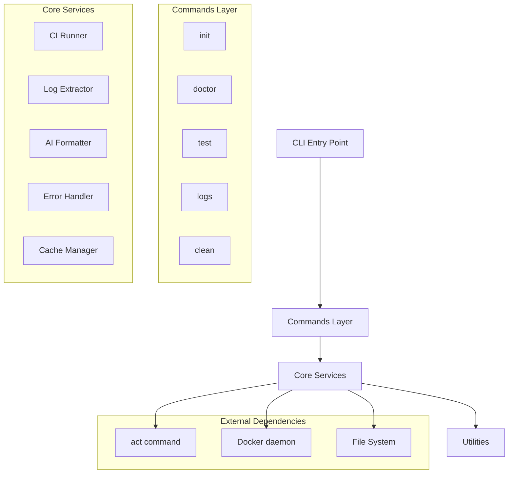
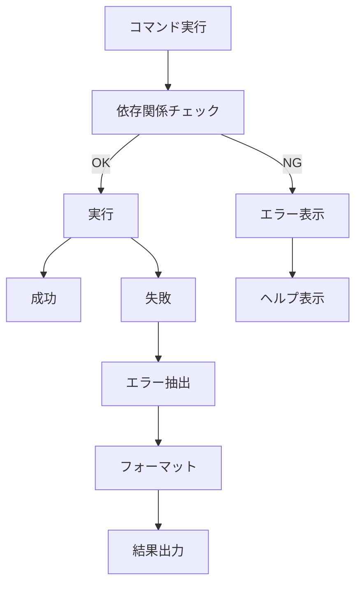

# 設計文書

## 概要

ci-helperは、`act`を使用したローカルCI/CD検証とAI統合を提供するPython製CLIツールです。マルチコマンド構造を採用し、段階的な機能拡張を可能にする設計となっています。フェーズ1では基本的なCI実行とログ解析機能を提供し、将来的にAI統合機能を追加できる拡張可能なアーキテクチャを採用します。

## アーキテクチャ

### 全体構成

```
ci-helper/
├── src/ci_helper/
│   ├── cli.py                  # CLIエントリーポイント
│   ├── commands/               # サブコマンド実装
│   ├── core/                   # コア機能
│   ├── utils/                  # ユーティリティ
│   └── config/                 # 設定管理
```

### アーキテクチャ図



### レイヤー構成

1. **CLIレイヤー**: ユーザーインターフェースとコマンドルーティング
2. **コマンドレイヤー**: 各サブコマンドの実装
3. **コアサービスレイヤー**: ビジネスロジックと主要機能
4. **ユーティリティレイヤー**: 共通機能と設定管理

## コンポーネントと インターフェース

### 1. CLIエントリーポイント (`cli.py`)

```python
@click.group()
@click.version_option()
@click.pass_context
def cli(ctx):
    """ci-helper: ローカルCI検証とAI連携ツール"""
    ctx.ensure_object(dict)
    ctx.obj['config'] = load_config()
```

**責任**:
- コマンドグループの定義
- グローバル設定の初期化
- バージョン情報の提供

### 2. コマンドモジュール (`commands/`)

#### `init.py`
```python
@click.command()
@click.option('--force', is_flag=True, help='既存ファイルを上書き')
def init(force):
    """設定ファイルテンプレートを生成"""
```

#### `doctor.py`
```python
@click.command()
@click.option('--verbose', '-v', is_flag=True)
def doctor(verbose):
    """環境依存関係をチェック"""
```

#### `test.py`
```python
@click.command()
@click.option('--workflow', '-w', multiple=True)
@click.option('--verbose', '-v', is_flag=True)
@click.option('--format', type=click.Choice(['markdown', 'json']))
@click.option('--dry-run', is_flag=True)
@click.option('--log', type=click.Path(exists=True))
@click.option('--diff', is_flag=True)
@click.option('--save/--no-save', default=True)
def test(**kwargs):
    """CI/CDワークフローをローカルで実行"""
```

### 3. コアサービス (`core/`)

#### `ci_run.py`
```python
class CIRunner:
    def __init__(self, config: Config):
        self.config = config
        self.log_extractor = LogExtractor()
        self.formatter = AIFormatter()

    def run_workflows(self, workflows: List[str]) -> ExecutionResult:
        """ワークフローを実行し結果を返す"""

    def execute_act(self, workflow: str) -> subprocess.CompletedProcess:
        """actコマンドを実行"""
```

#### `extract_failures.py`
```python
class LogExtractor:
    def extract_failures(self, log_content: str) -> List[Failure]:
        """ログから失敗情報を抽出"""

    def parse_error_patterns(self, content: str) -> List[ErrorMatch]:
        """エラーパターンをマッチング"""

    def get_context_lines(self, content: str, line_num: int, context: int) -> str:
        """エラー周辺のコンテキストを取得"""
```

#### `format_for_ai.py`
```python
class AIFormatter:
    def format_markdown(self, failures: List[Failure]) -> str:
        """Markdown形式でフォーマット"""

    def format_json(self, failures: List[Failure]) -> str:
        """JSON形式でフォーマット"""

    def count_tokens(self, content: str) -> int:
        """トークン数をカウント"""
```

### 4. データモデル

#### 実行結果
```python
@dataclass
class ExecutionResult:
    success: bool
    workflows: List[WorkflowResult]
    total_duration: float
    log_path: Optional[str]

@dataclass
class WorkflowResult:
    name: str
    success: bool
    jobs: List[JobResult]
    duration: float

@dataclass
class JobResult:
    name: str
    success: bool
    failures: List[Failure]
    steps: List[StepResult]
```

#### 失敗情報
```python
@dataclass
class Failure:
    type: FailureType  # ERROR, ASSERTION, TIMEOUT, etc.
    message: str
    file_path: Optional[str]
    line_number: Optional[int]
    context_before: List[str]
    context_after: List[str]
    stack_trace: Optional[str]
```

### 5. 設定管理 (`utils/config.py`)

```python
class Config:
    def __init__(self):
        self.project_config = self._load_project_config()
        self.env_config = self._load_env_config()

    def get(self, key: str, default=None):
        """設定値を優先順位に従って取得"""
        # 1. 環境変数
        # 2. プロジェクト設定ファイル
        # 3. デフォルト値
```

## エラーハンドリング

### エラー分類と対応

```python
class CIHelperError(Exception):
    """基底例外クラス"""

class DependencyError(CIHelperError):
    """依存関係エラー (act, Docker未インストール等)"""

class ConfigurationError(CIHelperError):
    """設定エラー"""

class ExecutionError(CIHelperError):
    """実行時エラー"""

class ValidationError(CIHelperError):
    """入力検証エラー"""
```

### エラーハンドリング戦略

1. **依存関係チェック**: 実行前に必要な依存関係を検証
2. **グレースフルデグラデーション**: 部分的な失敗でも可能な限り結果を提供
3. **ユーザーフレンドリーなメッセージ**: 技術的詳細と解決策を提供
4. **ログ記録**: デバッグ用の詳細ログを保持

### エラー処理フロー



## テスト戦略

### テストピラミッド

1. **ユニットテスト** (70%)
   - 各モジュールの個別機能
   - モックを使用した外部依存の分離
   - 高速実行とカバレッジ重視

2. **統合テスト** (20%)
   - コンポーネント間の連携
   - 実際のワークフローファイルを使用
   - act実行を含む実際のフロー

3. **E2Eテスト** (10%)
   - CLIコマンドの完全なフロー
   - 実際のユーザーシナリオ

### テスト構成

```
tests/
├── unit/
│   ├── test_extract_failures.py
│   ├── test_format_for_ai.py
│   ├── test_config.py
│   └── test_error_handler.py
├── integration/
│   ├── test_ci_run.py
│   └── test_command_flow.py
├── e2e/
│   └── test_cli_commands.py
└── fixtures/
    ├── sample_workflows/
    ├── sample_logs/
    └── expected_outputs/
```

### テストデータ管理

- **フィクスチャ**: 実際のワークフローとログサンプル
- **モック**: 外部依存（act、Docker）のモック
- **パラメータ化**: 複数のシナリオを効率的にテスト

## パフォーマンス考慮事項

### 実行時間最適化

1. **並列実行**: 複数ワークフローの並列処理
2. **キャッシュ**: ログ解析結果のキャッシュ
3. **ストリーミング**: 大きなログファイルのストリーミング処理
4. **遅延読み込み**: 必要時のみモジュール読み込み

### メモリ使用量最適化

1. **ジェネレータ**: 大きなファイルの逐次処理
2. **チャンク処理**: ログファイルの分割処理
3. **ガベージコレクション**: 適切なオブジェクト管理

### ディスク使用量管理

1. **ログローテーション**: 古いログの自動削除
2. **圧縮**: ログファイルの圧縮保存
3. **設定可能な制限**: ユーザー定義の容量制限

## セキュリティ設計

### シークレット管理

1. **環境変数優先**: APIキーは環境変数からのみ読み取り
2. **ログフィルタリング**: 機密情報の自動検出と除去
3. **設定ファイル検証**: シークレットの設定ファイル記載を禁止

### 入力検証

1. **パス検証**: ファイルパスのサニタイゼーション
2. **コマンド検証**: 実行コマンドの検証
3. **設定検証**: 設定値の型と範囲チェック

## 拡張性設計

### プラグインアーキテクチャ

将来的なプラグイン対応のための設計：

```python
class Plugin:
    def register_commands(self, cli_group):
        """コマンドを登録"""

    def register_extractors(self, extractor_registry):
        """カスタム抽出器を登録"""

    def register_formatters(self, formatter_registry):
        """カスタムフォーマッターを登録"""
```

### AI統合準備

フェーズ3のAI統合に向けた設計：

```python
class AIProvider:
    def analyze_failures(self, failures: List[Failure]) -> AnalysisResult:
        """失敗を分析"""

    def suggest_fixes(self, analysis: AnalysisResult) -> List[Fix]:
        """修正提案を生成"""

class AIIntegration:
    def __init__(self, provider: AIProvider):
        self.provider = provider

    def process_with_ai(self, execution_result: ExecutionResult) -> AIResult:
        """AI処理を実行"""
```

## 設定とカスタマイゼーション

### 設定ファイル階層

1. **デフォルト設定**: コード内のデフォルト値
2. **グローバル設定**: `~/.ci-helper/config.toml`
3. **プロジェクト設定**: `./ci-helper.toml`
4. **環境変数**: `CI_HELPER_*`
5. **コマンドライン引数**: 最高優先度

### カスタマイゼーションポイント

1. **抽出パターン**: カスタムエラーパターンの定義
2. **フォーマットテンプレート**: 出力形式のカスタマイズ
3. **フィルタリングルール**: ログフィルタリングのカスタマイズ
4. **通知設定**: 実行結果の通知方法

この設計により、要件で定義されたすべての機能を実現し、将来的な拡張にも対応できる柔軟で保守性の高いシステムを構築できます。
