# テストカバレッジ向上 設計文書

## 概要

ci-helperプロジェクトのテストカバレッジを74%から80%以上に向上させるため、未カバー行数が最も多い3つのモジュールに対して戦略的にテストケースを追加します。既存のテストファイル構造を維持しながら、効率的にカバレッジを向上させる設計を採用します。

## アーキテクチャ

### テスト改善対象モジュール

```
ci-helper/
├── src/ci_helper/
│   ├── commands/
│   │   └── analyze.py          # 506未カバー行 (最優先)
│   └── ai/
│       ├── integration.py      # 177未カバー行 (第2優先)
│       └── error_handler.py    # 107未カバー行 (第3優先)
└── tests/
    ├── unit/
    │   ├── commands/
    │   │   └── test_analyze.py         # 既存 - 拡張対象
    │   └── ai/
    │       ├── test_integration.py     # 新規作成
    │       └── test_error_handler.py   # 新規作成
    └── integration/
        └── test_ai_integration.py      # 既存 - 統合テスト強化
```

### テスト改善戦略図

```mermaid
graph TB
    subgraph "Priority 1: analyze.py (506 lines)"
        A1[Interactive Mode Tests]
        A2[Fix Application Tests]
        A3[Streaming Tests]
        A4[Error Handling Tests]
        A5[Edge Cases Tests]
    end

    subgraph "Priority 2: integration.py (177 lines)"
        B1[AIIntegration Core Tests]
        B2[Provider Management Tests]
        B3[Async Processing Tests]
        B4[Cache Integration Tests]
        B5[Performance Tests]
    end

    subgraph "Priority 3: error_handler.py (107 lines)"
        C1[Error Type Handling Tests]
        C2[Fallback Mechanism Tests]
        C3[Retry Logic Tests]
        C4[Recovery Process Tests]
        C5[Logging Tests]
    end

    subgraph "Test Infrastructure"
        D1[Mock Factories]
        D2[Test Fixtures]
        D3[Helper Functions]
        D4[Performance Benchmarks]
    end

    A1 --> D1
    A2 --> D2
    B1 --> D1
    B2 --> D3
    C1 --> D1
    C2 --> D4
```



## コンポーネントと インターフェース

### 1. analyze.py テスト拡張 (`tests/unit/commands/test_analyze.py`)

#### 新規追加テストクラス

```python
class TestAnalyzeInteractiveMode:
    """対話モードの包括的テスト"""

    def test_interactive_session_start(self):
        """対話セッション開始のテスト"""

    def test_interactive_command_processing(self):
        """対話コマンド処理のテスト"""

    def test_interactive_session_timeout(self):
        """セッションタイムアウトのテスト"""

    def test_interactive_context_preservation(self):
        """コンテキスト保持のテスト"""

class TestAnalyzeFixApplication:
    """修正提案・適用機能の詳細テスト"""

    def test_fix_suggestion_generation(self):
        """修正提案生成のテスト"""

    def test_automatic_fix_application(self):
        """自動修正適用のテスト"""

    def test_backup_creation_and_restoration(self):
        """バックアップ作成・復元のテスト"""

    def test_multi_file_fix_approval(self):
        """複数ファイル修正承認のテスト"""

class TestAnalyzeStreamingFeatures:
    """ストリーミング機能の詳細テスト"""

    def test_streaming_response_display(self):
        """ストリーミング応答表示のテスト"""

    def test_streaming_interruption_handling(self):
        """ストリーミング中断処理のテスト"""

    def test_progress_indicator_updates(self):
        """プログレス表示更新のテスト"""

    def test_streaming_error_recovery(self):
        """ストリーミングエラー復旧のテスト"""

class TestAnalyzeEdgeCases:
    """エッジケースとエラーシナリオ"""

    def test_empty_log_file_handling(self):
        """空ログファイル処理のテスト"""

    def test_large_log_file_processing(self):
        """大きなログファイル処理のテスト"""

    def test_malformed_log_content(self):
        """不正形式ログ内容のテスト"""

    def test_concurrent_analysis_requests(self):
        """同時分析リクエストのテスト"""
```

### 2. integration.py テスト作成 (`tests/unit/ai/test_integration.py`)

#### 新規テストファイル構造

```python
class TestAIIntegrationCore:
    """AIIntegrationクラスの中核機能テスト"""

    def test_initialization_with_config(self):
        """設定を使用した初期化のテスト"""

    def test_provider_factory_integration(self):
        """プロバイダーファクトリー統合のテスト"""

    def test_analysis_workflow_orchestration(self):
        """分析ワークフロー統制のテスト"""

    def test_resource_cleanup_on_shutdown(self):
        """シャットダウン時のリソースクリーンアップのテスト"""

class TestProviderManagement:
    """プロバイダー管理機能のテスト"""

    def test_dynamic_provider_switching(self):
        """動的プロバイダー切り替えのテスト"""

    def test_provider_fallback_mechanism(self):
        """プロバイダーフォールバック機構のテスト"""

    def test_provider_health_checking(self):
        """プロバイダーヘルスチェックのテスト"""

    def test_provider_configuration_validation(self):
        """プロバイダー設定検証のテスト"""

class TestAsyncProcessing:
    """非同期処理機能のテスト"""

    def test_concurrent_analysis_execution(self):
        """並行分析実行のテスト"""

    def test_async_timeout_handling(self):
        """非同期タイムアウト処理のテスト"""

    def test_async_error_propagation(self):
        """非同期エラー伝播のテスト"""

    def test_async_resource_management(self):
        """非同期リソース管理のテスト"""

class TestCacheIntegration:
    """キャッシュ統合機能のテスト"""

    def test_cache_hit_optimization(self):
        """キャッシュヒット最適化のテスト"""

    def test_cache_miss_handling(self):
        """キャッシュミス処理のテスト"""

    def test_cache_ttl_management(self):
        """キャッシュTTL管理のテスト"""

    def test_cache_invalidation_strategies(self):
        """キャッシュ無効化戦略のテスト"""
```

### 3. error_handler.py テスト作成 (`tests/unit/ai/test_error_handler.py`)

#### 新規テストファイル構造

```python
class TestErrorTypeHandling:
    """エラータイプ別ハンドリングのテスト"""

    def test_api_key_error_handling(self):
        """APIキーエラーハンドリングのテスト"""

    def test_rate_limit_error_handling(self):
        """レート制限エラーハンドリングのテスト"""

    def test_network_error_handling(self):
        """ネットワークエラーハンドリングのテスト"""

    def test_token_limit_error_handling(self):
        """トークン制限エラーハンドリングのテスト"""

class TestFallbackMechanisms:
    """フォールバック機構のテスト"""

    def test_ai_failure_fallback_to_basic_analysis(self):
        """AI失敗時の基本分析フォールバックのテスト"""

    def test_provider_failure_fallback_chain(self):
        """プロバイダー失敗時のフォールバックチェーンのテスト"""

    def test_partial_result_preservation(self):
        """部分的結果保存のテスト"""

    def test_graceful_degradation_strategies(self):
        """優雅な機能低下戦略のテスト"""

class TestRetryLogic:
    """リトライロジックのテスト"""

    def test_exponential_backoff_implementation(self):
        """指数バックオフ実装のテスト"""

    def test_retry_limit_enforcement(self):
        """リトライ制限実施のテスト"""

    def test_retry_condition_evaluation(self):
        """リトライ条件評価のテスト"""

    def test_retry_state_management(self):
        """リトライ状態管理のテスト"""

class TestRecoveryProcesses:
    """復旧プロセスのテスト"""

    def test_automatic_recovery_procedures(self):
        """自動復旧手順のテスト"""

    def test_manual_recovery_guidance(self):
        """手動復旧ガイダンスのテスト"""

    def test_recovery_progress_tracking(self):
        """復旧進捗追跡のテスト"""

    def test_recovery_success_validation(self):
        """復旧成功検証のテスト"""
```

## データモデル

### テスト用データ構造

```python
@dataclass
class TestScenario:
    """テストシナリオの定義"""
    name: str
    description: str
    input_data: Dict[str, Any]
    expected_output: Dict[str, Any]
    mock_configurations: List[MockConfig]
    assertions: List[Assertion]

@dataclass
class MockConfig:
    """モック設定の定義"""
    target_module: str
    target_function: str
    return_value: Any
    side_effect: Optional[Exception]
    call_count: int

@dataclass
class CoverageTarget:
    """カバレッジ目標の定義"""
    module_path: str
    current_coverage: float
    target_coverage: float
    uncovered_lines: int
    priority_functions: List[str]
```

### テストフィクスチャ

```python
@pytest.fixture
def mock_ai_integration():
    """AI統合のモック"""
    integration = Mock(spec=AIIntegration)
    integration.initialize = AsyncMock()
    integration.analyze_log = AsyncMock()
    integration.start_interactive_session = AsyncMock()
    return integration

@pytest.fixture
def sample_analysis_result():
    """サンプル分析結果"""
    return AnalysisResult(
        summary="テスト分析結果",
        root_causes=[],
        fix_suggestions=[],
        confidence_score=0.85,
        analysis_time=2.5,
        tokens_used=TokenUsage(input_tokens=100, output_tokens=50),
        status=AnalysisStatus.COMPLETED
    )

@pytest.fixture
def large_log_content():
    """大きなログファイルのコンテンツ"""
    return "\n".join([f"Log line {i}: Some error occurred" for i in range(10000)])

@pytest.fixture
def malformed_log_content():
    """不正形式のログコンテンツ"""
    return "Invalid log format\x00\x01\x02"
```

## テスト戦略

### 1. 既存テスト拡張戦略

#### analyze.py テスト拡張

- **対象**: `tests/unit/commands/test_analyze.py`
- **方針**: 既存のテストクラスに新しいテストクラスを追加
- **重点領域**: 対話モード、修正適用、ストリーミング、エッジケース
- **カバレッジ目標**: 36% → 70% (約34%向上)

#### 拡張ポイント

```python
# 既存のTestAnalyzeCommandクラスに加えて以下を追加:
# - TestAnalyzeInteractiveMode (対話機能)
# - TestAnalyzeFixApplication (修正適用)
# - TestAnalyzeStreamingFeatures (ストリーミング)
# - TestAnalyzeEdgeCases (エッジケース)
# - TestAnalyzePerformance (パフォーマンス)
```

### 2. 新規テスト作成戦略

#### integration.py テスト作成

- **対象**: `tests/unit/ai/test_integration.py` (新規作成)
- **方針**: 包括的なユニットテストスイートを作成
- **重点領域**: 中核機能、プロバイダー管理、非同期処理、キャッシュ統合
- **カバレッジ目標**: 58% → 85% (約27%向上)

#### error_handler.py テスト作成

- **対象**: `tests/unit/ai/test_error_handler.py` (新規作成)
- **方針**: エラーハンドリングの全パターンをカバー
- **重点領域**: エラータイプ処理、フォールバック、リトライ、復旧
- **カバレッジ目標**: 26% → 80% (約54%向上)

### 3. モック戦略

#### AI API モック

```python
class MockAIProvider:
    """AI プロバイダーのモック実装"""

    async def analyze(self, prompt: str, context: str) -> AnalysisResult:
        """分析のモック実装"""
        return self._create_mock_result()

    async def stream_analyze(self, prompt: str, context: str) -> AsyncIterator[str]:
        """ストリーミング分析のモック実装"""
        for chunk in self._generate_mock_chunks():
            yield chunk

    def _simulate_error(self, error_type: str):
        """エラーシミュレーション"""
        error_map = {
            'api_key': APIKeyError('openai', 'Invalid API key'),
            'rate_limit': RateLimitError('openai', retry_after=60),
            'network': NetworkError('Connection timeout'),
            'token_limit': TokenLimitError(5000, 4000, 'gpt-4o')
        }
        raise error_map.get(error_type, Exception('Unknown error'))
```

#### ファイルシステムモック

```python
@pytest.fixture
def mock_file_system(tmp_path):
    """ファイルシステムのモック"""
    # 一時ディレクトリにテスト用ファイルを作成
    log_dir = tmp_path / ".ci-helper" / "logs"
    log_dir.mkdir(parents=True)

    # サンプルログファイル
    (log_dir / "act_20241019_120000.log").write_text("Sample log content")

    return tmp_path
```

### 4. パフォーマンステスト戦略

#### メモリ使用量テスト

```python
def test_memory_usage_with_large_logs():
    """大きなログファイルでのメモリ使用量テスト"""
    import psutil
    import os

    process = psutil.Process(os.getpid())
    initial_memory = process.memory_info().rss

    # 大きなログファイルを処理
    result = analyze_large_log(large_log_content)

    final_memory = process.memory_info().rss
    memory_increase = final_memory - initial_memory

    # メモリ増加が合理的な範囲内であることを確認
    assert memory_increase < 100 * 1024 * 1024  # 100MB未満
```

#### 処理時間テスト

```python
def test_analysis_performance_benchmarks():
    """分析パフォーマンスベンチマークテスト"""
    import time

    start_time = time.time()
    result = analyze_log(standard_log_content)
    end_time = time.time()

    processing_time = end_time - start_time

    # 処理時間が合理的な範囲内であることを確認
    assert processing_time < 30.0  # 30秒未満
    assert result.analysis_time < processing_time
```

## エラーハンドリング設計

### エラーシナリオマトリックス

| エラータイプ | テスト対象 | 期待される動作 | 検証ポイント |
|-------------|-----------|---------------|-------------|
| APIキーエラー | 全プロバイダー | 明確なエラーメッセージ表示 | メッセージ内容、設定ガイド |
| レート制限 | OpenAI/Anthropic | リトライ待機とユーザー通知 | 待機時間、リトライ回数 |
| ネットワークエラー | 全プロバイダー | 自動リトライとフォールバック | リトライロジック、タイムアウト |
| トークン制限 | 全プロバイダー | ログ圧縮と再試行 | 圧縮率、再試行成功率 |
| 設定エラー | システム全体 | 設定検証と修正提案 | 検証ロジック、提案内容 |

### フォールバック戦略テスト

```python
def test_comprehensive_fallback_chain():
    """包括的フォールバックチェーンのテスト"""

    # 1. 主要プロバイダー失敗をシミュレート
    with patch('ai.providers.openai.OpenAIProvider.analyze') as mock_openai:
        mock_openai.side_effect = APIKeyError('openai', 'Invalid key')

        # 2. 代替プロバイダーも失敗をシミュレート
        with patch('ai.providers.anthropic.AnthropicProvider.analyze') as mock_anthropic:
            mock_anthropic.side_effect = RateLimitError('anthropic')

            # 3. 最終的に基本分析にフォールバック
            result = ai_integration.analyze_log(log_content)

            # 4. フォールバック結果の検証
            assert result.status == AnalysisStatus.FALLBACK_USED
            assert result.summary is not None
            assert "基本分析" in result.summary
```

## 品質保証

### テストコード品質基準

1. **可読性**: 各テストケースに明確な日本語コメント
2. **独立性**: テスト間の依存関係を排除
3. **再現性**: 同じ条件で同じ結果を保証
4. **保守性**: 既存コードの変更に対する耐性
5. **実用性**: 実際の使用パターンを反映

### アサーション戦略

```python
def test_analysis_result_completeness():
    """分析結果の完全性テスト"""
    result = ai_integration.analyze_log(sample_log)

    # 必須フィールドの存在確認
    assert result.summary is not None
    assert len(result.summary) > 0
    assert result.confidence_score >= 0.0
    assert result.confidence_score <= 1.0
    assert result.analysis_time > 0
    assert result.tokens_used.total_tokens > 0

    # ビジネスロジックの検証
    if result.root_causes:
        assert all(cause.severity in ['LOW', 'MEDIUM', 'HIGH', 'CRITICAL']
                  for cause in result.root_causes)

    if result.fix_suggestions:
        assert all(fix.priority in ['LOW', 'MEDIUM', 'HIGH', 'CRITICAL']
                  for fix in result.fix_suggestions)
```

### CI/CD統合

```yaml
# .github/workflows/test.yml への追加
- name: Run Coverage Tests
  run: |
    uv run pytest tests/unit/commands/test_analyze.py::TestAnalyzeInteractiveMode -v
    uv run pytest tests/unit/ai/test_integration.py -v
    uv run pytest tests/unit/ai/test_error_handler.py -v

- name: Check Coverage Improvement
  run: |
    uv run pytest --cov=src/ci_helper/commands/analyze --cov-report=term
    uv run pytest --cov=src/ci_helper/ai/integration --cov-report=term
    uv run pytest --cov=src/ci_helper/ai/error_handler --cov-report=term
```

この設計により、効率的にテストカバレッジを向上させ、コードの品質と信頼性を大幅に改善できます。既存のテスト構造を尊重しながら、戦略的にカバレッジギャップを埋める包括的なアプローチを採用しています。
